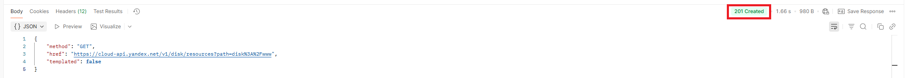

# Задача Т2. Написание баг-репорта.

## Часть 1. UI

### BR-1. Слитное написание "Вслучае" в требовании "Часть 1. UI" в 4-ом пункте раздела "Условие задачи" 
#### Шаги:
1. Открыть требование "Часть 1. UI"
2. Обратить внимание на слово "Вслучае" 4-го пункта раздела "Условие задачи"
#### ФР: "Вслучае" написано слитно
#### ОР: "В случае" написано раздельно
#### Окружение: Windows 11
#### Серьезность: незначительный
#### Приоритет: низкий

### BR-2. Отсутствие слов "или папок" после слов "... если нет файлов,..." в требовании "Часть 1. UI" в 4-ом пункте раздела "Условие задачи"
#### Шаги:
1. Открыть требование "Часть 1. UI"
2. Обратить внимание на слова "... если нет файлов,..." 4-го пункта раздела "Условие задачи"
#### ФР: Отсутствуют слова "или папок" после слов "... если нет файлов,..."
#### ОР: "В случае, если нет файлов или папок,..."
#### Окружение: Windows 11
#### Серьезность: высокий (major)
#### Приоритет: высокий

### BR-3. Предлог "В" вместо "На" в сообщении об отсутствии файлов или папок в требовании "Часть 1. UI" в 4-ом пункте раздела "Условие задачи"
#### Шаги:
1. Открыть требование "Часть 1. UI"
2. Обратить внимание на предлог "В" в сообщении об отсутствии файлов или папок 4-го пункта раздела "Условие задачи"
#### ФР: "В вашем диске не найдено ..."
#### ОР: "На вашем диске не найдено ..."
#### Окружение: Windows 11
#### Серьезность: незначительный
#### Приоритет: низкий

### BR-4. Слово "диске" начинается с маленькой буквы в сообщении об отсутствии файлов или папок в приложении Яндекс.Диск
#### Шаги:
1. Открыть Яндекс.Диск
2. В поле поиска ввести заведомо несуществующие файл или папку, например, "dfgdgdgfdgfdfgfgdggfd"
3. Нажать на кнопку "Найти" или Enter
4. Обратить внимание на сообщение об отсутствии файлов или папок
#### ФР: "На вашем диске ..."
#### ОР: "На вашем Диске ..."
#### Окружение: Windows 11
#### Серьезность: незначительный
#### Приоритет: низкий

### BR-5. Двойные шевроны отображаются вместо одинарных в сообщении об отсутствии файлов или папок в приложении Яндекс.Диск
#### Шаги:
1. Открыть Яндекс.Диск
2. В поле поиска ввести заведомо несуществующие файл или папку, например, "dfgdgdgfdgfdfgfgdggfd"
3. Нажать на кнопку "Найти" или Enter
4. Обратить внимание на сообщение об отсутствии файлов или папок
#### ФР: Название файла или папки заключается в двойные шевроны
#### ОР: Название файла или папки заключается в одинарные шевроны
#### Окружение: Windows 11
#### Серьезность: незначительный
#### Приоритет: низкий

## Часть 2. API

### BR-6. Неверный код "200" в случае успешного выполнения запроса в 4-ом пункте требования "Часть 2. API"
#### Шаги:
1. Открыть требование "Часть 2. API"
2. Обратить внимание на получение кода ответа "200" в 4-ом пунке
#### ФР: код ответа "200"
#### ОР: код ответа "201"
#### Окружение: Windows 11
#### Серьезность: высокий (major)
#### Приоритет: высокий

### BR-7. Неверный код "400" при попытке создания объекта по уже существующему пути в 7-ом пункте требования "Часть 2. API"
#### Шаги: 
1. Открыть требование "Часть 2. API"
2. Обратить внимание на код ответа "400" в 7-ом пунке
#### ФР: код ответа "400"
#### ОР: код ответа "409"
#### Окружение: Windows 11
#### Серьезность: высокий (major)
#### Приоритет: высокий

### BR-8. Неверный код "200" в 8-ом пункте требования "Часть 2. API"
#### Шаги: 
1. Открыть требование "Часть 2. API"
2. Обратить внимание на код ответа "200" в 8-ом пунке
#### ФР: код ответа "200"
#### ОР: код ответа "201"
#### Окружение: Windows 11
#### Серьезность: высокий (major)
#### Приоритет: высокий

### BR-9. Неправильный порядок слова "уже" в сообщении о существующем пути в 7-ом пункте требования "Часть 2. API"
#### Шаги:
1. Открыть требование "Часть 2. API"
2. Обратить внимание на слово "уже" в 7-ом пунке
#### ФР: "При попытке создания уже по существующему пути ..."
#### ОР: "При попытке создания по уже существующему пути ..."
#### Окружение: Windows 11
#### Серьезность: незначительный
#### Приоритет: низкий

