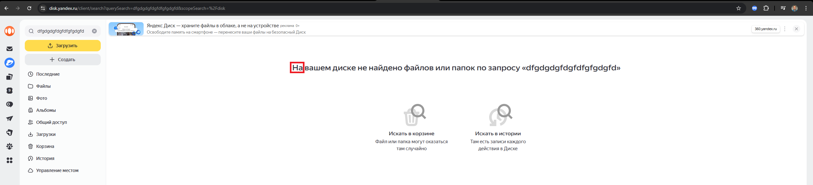
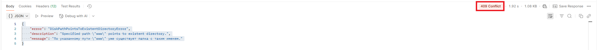

# Задача Т2. Написание баг-репорта.

## Замечания к оформлению требований:
1. Отсутствуют  уникальные идентификаторы для каждого требования.
2. Отсутствуют точки в конце требования.
3. Слитное написание "Вслучае" в требовании "Часть 1. UI" в 4-ом пункте раздела "Условие задачи".
4. Отсутствуют проверки на поиск по папкам из-за отсутствия сохранения папки себе на Яндекс.Диск в предусловии требования "Часть 1. UI".
5. Отсутствует упоминание папок при описании функционала об отсутствии результатов поиска в требовании "Часть 1. UI" в 4-ом пункте раздела "Условие задачи"
6. Отсутствует упоминание папок при описании функционала поиска в корзине в требовании "Часть 1. UI" в 5-ом пункте раздела "Условие задачи"
7. Предлог "В" вместо "На" в сообщении об отсутствии файлов или папок в требовании "Часть 1. UI" в 4-ом пункте раздела "Условие задачи".
8. Неправильный порядок слова "уже" в сообщении о существующем пути в 7-ом пункте требования "Часть 2. API".
9. Неправильный код "200" вместо "201" в случае успешного выполнения запроса в 4-ом пункте требования "Часть 2. API".
10. Неправильный код "400" вместо "409" при попытке создания по уже существующему пути в 7-ом пункте требования "Часть 2. API".
11. Неправильный код "200" вместо "201" в 8-ом пункте требования "Часть 2. API".

## Баг-репорты

## Часть 1. UI

### BR-1. Слово "диске" начинается с маленькой буквы в сообщении об отсутствии файлов или папок
#### Предусловие:
1. Открыть Яндекс.Диск
2. Сохранить себе на Яндекс.Диск два любых файла
#### Шаги:
1. В поле поиска Яндекс.Диска ввести название заведомо несуществующих на Яндекс.Диске файлов и папок, например, "dfgdgdgfdgfdfgfgdggfd"
2. Нажать на кнопку "Найти" или Enter
3. Обратить внимание на сообщение об отсутствии файлов или папок
#### ФР: "На вашем диске ..."
#### ОР: "На вашем Диске ..."
#### Окружение: Яндекс.Диск 1.8.6, Windows 11
#### Серьезность: незначительный
#### Приоритет: низкий

### BR-2. Предлог "В" вместо "На" в сообщении об отсутствии файлов или папок
#### Предусловие:
1. Открыть Яндекс.Диск
2. Сохранить себе на Яндекс.Диск два любых файла
#### Шаги:
1. В поле поиска Яндекс.Диска ввести название заведомо несуществующих на Яндекс.Диске файлов и папок, например, "dfgdgdgfdgfdfgfgdggfd"
2. Нажать на кнопку "Найти" или Enter
3. Обратить внимание на сообщение об отсутствии файлов или папок
#### ФР: "На вашем диске не найдено ..."
#### ОР: "В вашем диске не найдено ..."
#### Окружение: Яндекс.Диск 1.8.6, Windows 11
#### Серьезность: незначительный
#### Приоритет: низкий

### BR-3. Двойные шевроны отображаются вместо одинарных в сообщении об отсутствии файлов или папок
#### Предусловие:
1. Открыть Яндекс.Диск
2. Сохранить себе на Яндекс.Диск два любых файла
#### Шаги:
1. В поле поиска Яндекс.Диска ввести название заведомо несуществующих на Яндекс.Диске файлов и папок, например, "dfgdgdgfdgfdfgfgdggfd"
2. Нажать на кнопку "Найти" или Enter
3. Обратить внимание на сообщение об отсутствии файлов или папок
#### ФР: Название файла или папки заключается в двойные шевроны
#### ОР: Название файла или папки заключается в одинарные шевроны
#### Окружение: Яндекс.Диск 1.8.6, Windows 11
#### Серьезность: незначительный
#### Приоритет: низкий

## Часть 2. API

### BR-4. Неверный код "201" в случае успешного выполнения запроса
#### Предусловие:
1. Запустить сервис API
2. Получить OAuth-токен
#### Шаги:
1. Отправить PUT-запрос https://cloud-api.yandex.net:443/v1/disk/resources?path=www
с заголовками 
Content-Type: application/json, Authorization: [OAuth-токен]
#### ФР: 
статус-код "201",
тело JSON:
{
"method": "GET",
"href": "https://cloud-api.yandex.net/v1/disk/resources?path=disk%3A%2Fwww",
"templated": false
}
#### ОР: 
статус-код "200"
#### Окружение: Windows 11
#### Серьезность: высокий (major)
#### Приоритет: высокий

### BR-5. Неверный код "409" при попытке создания объекта по уже существующему пути
#### Предусловие:
1. Запустить сервис API
2. Получить OAuth-токен
3. Отправить PUT-запрос https://cloud-api.yandex.net:443/v1/disk/resources?path=www
   с заголовками
   Content-Type: application/json, Authorization: [OAuth-токен]
#### Шаги: 
1. Отправить PUT-запрос https://cloud-api.yandex.net:443/v1/disk/resources?path=www
   с заголовками
   Content-Type: application/json, Authorization: [OAuth-токен]
#### ФР: 
статус-код "409"
тело JSON:
{
"error": "DiskPathPointsToExistentDirectoryError",
"description": "Specified path \"www\" points to existent directory.",
"message": "По указанному пути \"www\" уже существует папка с таким именем."
}
#### ОР: 
статус-код "400"
#### Окружение: Windows 11
#### Серьезность: высокий (major)
#### Приоритет: высокий

### BR-6. Неверное тело ответа при возврате ответа от сервера отличного от статус-кода 200
#### Предусловие:
1. Запустить сервис API
2. Получить OAuth-токен
#### Шаги: 
1. Отправить PUT-запрос https://cloud-api.yandex.net:443/v1/disk/resources?path=www
с заголовками
Content-Type: application/json, Authorization: [OAuth-токен]
#### ФР: 
статус-код "201"
тело JSON:
{
"method": "GET",
"href": "https://cloud-api.yandex.net/v1/disk/resources?path=disk%3A%2Fwww",
"templated": false
}
#### ОР: 
статус-код "200"
тело JSON:
{
"message": "string",
"description": "string",
"error": "string"
}
#### Окружение: Windows 11
#### Серьезность: высокий (major)
#### Приоритет: высокий

